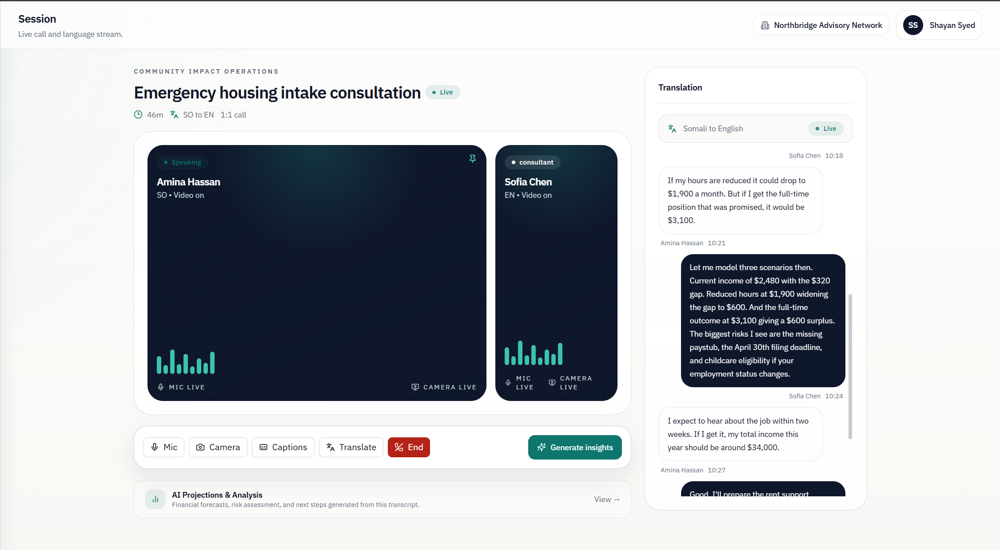
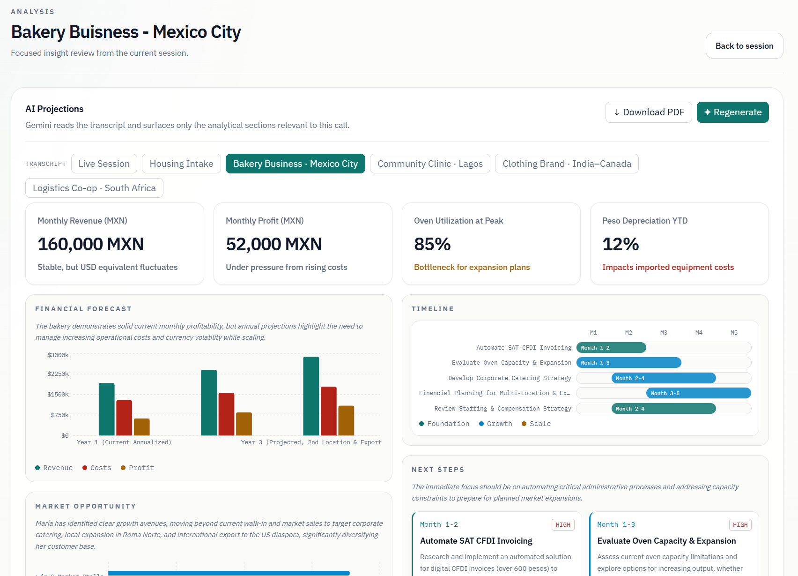

# Risus — Multilingual Consulting Platform

> AI-powered consultation tool for pro-bono advisors working with underserved communities across language and country barriers.

---

## Screenshots

### Live Session — Real-time multilingual video call


### AI Projections — Country-aware analysis


---

## What it does

A consultant joins a WebRTC video call with their client. Risus handles everything else:

- **Live translation** — speech is transcribed, translated, and spoken back in the target language in near real-time (ElevenLabs Scribe → Gemini Flash → ElevenLabs TTS), across 99 languages
- **AI projections** — Gemini reads the transcript and generates only the sections relevant to that conversation: financial forecasts, risk radars, market charts, team capacity, community impact
- **Country-aware analysis** — the AI surfaces legal, banking, and social constraints specific to the client's country: wire transfer fees, currency exposure, local tax obligations, purchasing power, geopolitical risk
- **PDF reports** — download a formatted AI projection report; reports are saved locally and accessible from the Deliverables page
- **Case repository** — searchable, anonymised case studies with a points-based publishing incentive for consultants

---

## Tech stack

| Layer | Tech |
|---|---|
| Frontend | Next.js 16 (App Router), React 19, Tailwind CSS 4 |
| Video calls | WebRTC peer-to-peer + Node.js / Socket.IO signalling server |
| STT | ElevenLabs Scribe |
| Translation | Google Gemini 2.5 Flash |
| TTS | ElevenLabs Turbo v2.5 |
| Charts | Recharts |
| Language | TypeScript throughout |

---

## Translation pipeline

```
Browser mic
  → MediaRecorder (audio/webm)
  → POST /api/translation/stt       (ElevenLabs Scribe)      → transcript
  → POST /api/translation/translate  (Gemini 2.5 Flash)      → translated text
  → POST /api/translation/tts       (ElevenLabs Turbo v2.5)  → audio blob
  → <audio> element plays
```

All API keys stay server-side in Next.js API routes — never exposed to the client.
Per-step latency (STT / LLM / TTS ms) is displayed in the test UI so bottlenecks are immediately visible.

---

## Getting started

### 1. Clone and install

```bash
git clone <repo-url>
cd Risus
npm install
```

### 2. Set environment variables

Create `.env.local` in the project root:

```env
GEMINI_API_KEY=your_gemini_api_key
ELEVENLABS_API_KEY=your_elevenlabs_api_key
```

### 3. Run the app

```bash
npm run dev
```

Open [http://localhost:3000](http://localhost:3000).

### 4. Run the WebRTC signalling server (for live video calls)

```bash
cd webrtc-testing/server
npm install
npm run dev
```

---

## Scripts

```bash
npm run dev      # Start dev server with Turbopack
npm run build    # Production build
npm run start    # Start production server
npm run lint     # ESLint (zero warnings policy)
```

---

## Demo transcripts

The Analysis tab ships with five built-in transcripts that demo country-specific AI insights:

| Scenario | Country | Key factors surfaced |
|---|---|---|
| Housing Intake | Minneapolis, USA (Somali refugee) | Hawala remittances, closed bank corridors, SNAP asset limits, USCIS visa risk |
| Bakery Business | Mexico City, Mexico | CFDI invoicing, IMSS payroll, peso/USD exposure, SAT tax authority, wage benchmarks |
| Community Clinic | Lagos, Nigeria | Naira devaluation vs USD grants, NHIA gaps, generator diesel costs, FIRS NGO audit risk |
| Clothing Brand | Toronto / Kerala, India–Canada | INR/CAD exchange rate, 18% MFN apparel tariff, overdue HST registration |
| Logistics Co-op | Soweto, South Africa | Rand/dollar fuel exposure, B-BBEE scorecard risk, SARB interest rates, hijacking insurance |

---

## Project structure

```
src/
├── app/
│   ├── (app)/
│   │   ├── session/           # Live call page (video + transcript + controls)
│   │   ├── analysis/          # AI projections
│   │   ├── deliverables/      # Case repository + saved PDF reports
│   │   └── translation-test/  # Translation pipeline test UI
│   └── api/
│       ├── projections/       # Gemini analysis endpoint
│       └── translation/
│           ├── stt/           # ElevenLabs Scribe
│           ├── translate/     # Gemini translation
│           └── tts/           # ElevenLabs TTS
├── components/
│   ├── calls/                 # Video tiles, controls, transcript panel
│   ├── workspace/             # AI projections, charts
│   ├── deliverables/          # Case cards, saved documents panel
│   └── ui/                    # Design system (Button, Card, MetricCard…)
└── lib/
    ├── types.ts
    ├── mock-data.ts
    └── utils.ts

webrtc-testing/
├── server/                    # Node.js + Socket.IO signalling server
└── client/                    # Vite + React WebRTC test client
```

---

## What's next

- **Streaming translation** — WebSocket-based STT + TTS to reduce perceived latency below 500ms
- **Persistent backend** — database for session history, reports, and case records across devices
- **In-call overlay** — live translated captions and AI risk flags on the video screen during the call
- **Bilingual document export** — formatted Word/PDF deliverables for clients to take away
- **Organisation dashboard** — aggregate impact metrics across all sessions: clients served, languages used, outcomes tracked
